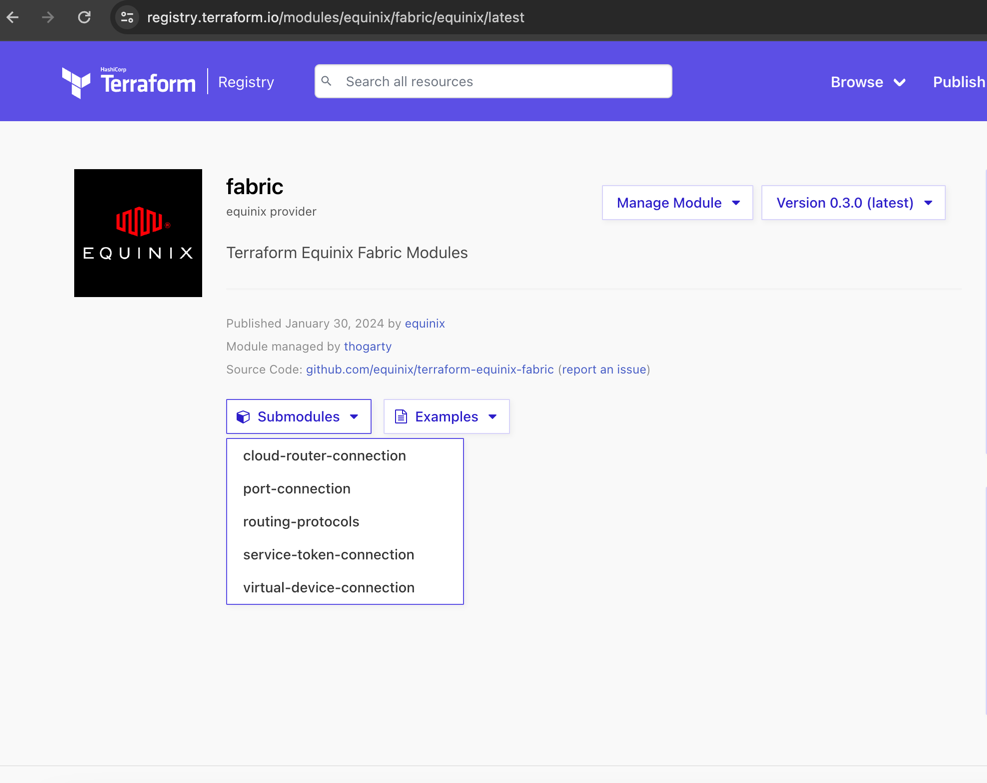
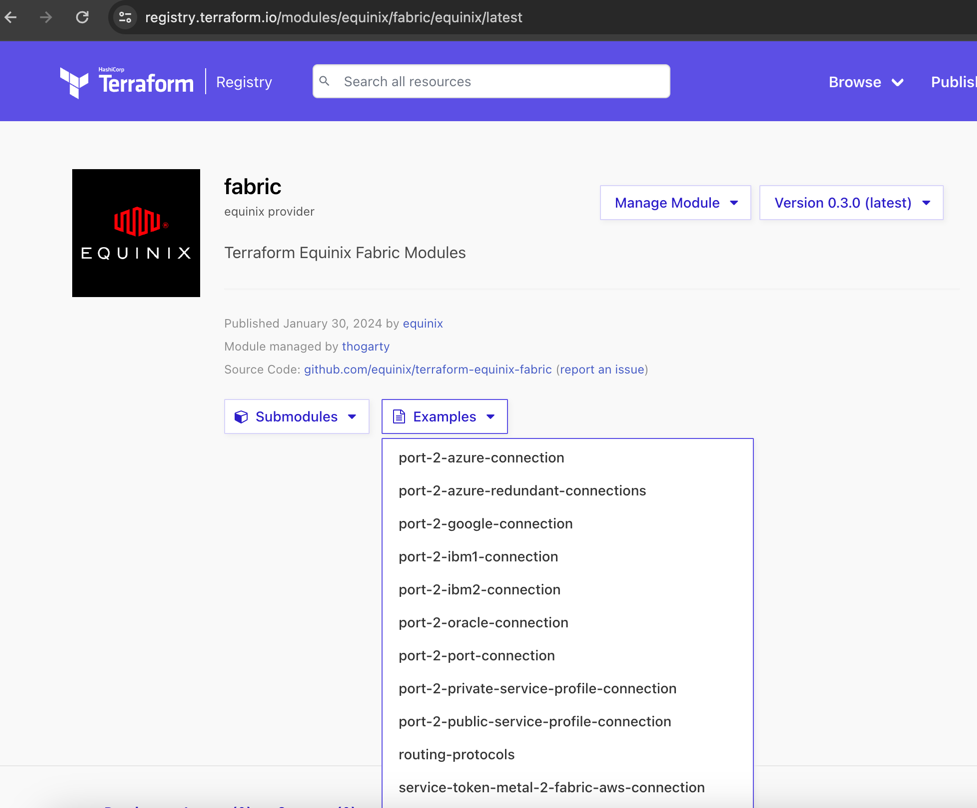

# Equinix Provider Examples - edge networking

## Fabric v4 Terraform Modules

Below table lists Terraform modules that can be used for convenient and
quick deployment of the Fabric Product Suite on Platform Equinix.

Please check module links for usage details and examples.

| Type                         | Description                                                    | Terraform Module                                                                                                                                   |
|------------------------------|----------------------------------------------------------------|----------------------------------------------------------------------------------------------------------------------------------------------------|
| Full Fabric v4 Product Suite | (Links to all Submodules + Examples)                           | [Fabric Terraform Modules](https://registry.terraform.io/modules/equinix/fabric/equinix/latest)                                                    |

## Fabric Terraform Submodules

Go to the Fabric Product Suite Modules Registry link above, and select the Submodules drop down:

This allows you to select a Fabric Submodule to learn more information about. The examples in the module will
provide details on how to use the module for common Fabric use cases.

## Fabric Terraform Examples

Go to the Fabric Product Suite Modules Registry link above, and select the Examples drop down:

These examples will teach you how to use the Fabric Product Suite Submodules to perform common Fabric
use cases leveraging the submodules found in the same registry listing.

